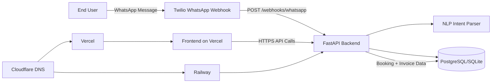
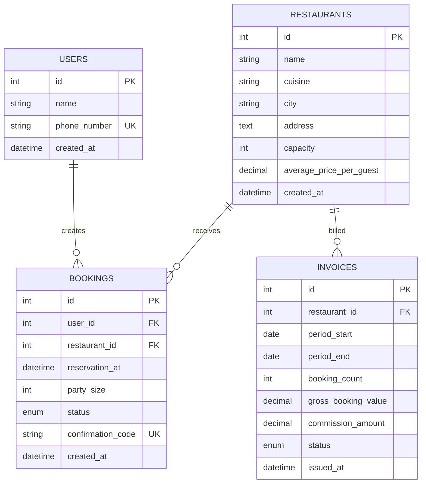

# Architecture

## System Diagram

## Database Schema

Enums:
- `booking.status`: `pending`, `confirmed`, `denied`
- `invoice.status`: `draft`, `sent`, `paid`

## API Flow

### Booking Creation and Confirmation
1. Client creates user (`POST /users`) if needed.
2. Client creates restaurant (`POST /restaurants`) or uses existing.
3. Client creates booking (`POST /bookings`) -> backend validates:
   - restaurant exists
   - party size <= restaurant capacity
   - no confirmed-capacity conflict in +/-2h window
4. Backend returns pending booking with unique 6-char confirmation code.
5. Client confirms (`POST /bookings/{id}/confirm`) or denies (`POST /bookings/{id}/deny`).

### Restaurant Search
1. Client calls `GET /restaurants/search` with date/time/party_size.
2. Backend filters restaurants by capacity (and optional city).
3. Backend calculates booked seats among confirmed bookings for nearby time window.
4. Backend returns ordered list with `available` flag per restaurant.

### WhatsApp Intent Parsing
1. Twilio calls `POST /webhooks/whatsapp`.
2. Backend checks `x-twilio-signature` header only when `TWILIO_AUTH_TOKEN` is configured.
3. NLP parser extracts:
   - restaurant name (`at <name>`)
   - party size (`for <N>` / `party of <N>`)
   - datetime (`dateutil` fuzzy parse)

### Monthly Invoicing
1. Scheduler/manual trigger calls `POST /invoices/monthly?month=YYYY-MM`.
2. Backend loads confirmed bookings in target period.
3. Gross = `sum(party_size * average_price_per_guest)`.
4. Commission = `gross * COMMISSION_RATE`.
5. Draft invoice rows are stored and returned.

## Tech Stack Decisions

### Backend
- FastAPI: fast route development + autogenerated OpenAPI.
- SQLAlchemy 2.0 ORM: explicit models and service-layer logic.
- Alembic: migration versioning and repeatable schema rollout.

### Data
- SQLite default for local speed and zero setup.
- PostgreSQL for production durability and concurrency.

### Integrations
- Twilio webhook entry point for WhatsApp message ingestion.
- `python-dateutil` + regex for lightweight NLP extraction.

### Deployment
- Railway for backend due to simple Nixpacks build + health checks.
- Vercel for frontend due to quick Next.js deployment and preview workflows.
- Cloudflare DNS for domain routing and managed DNS records.
